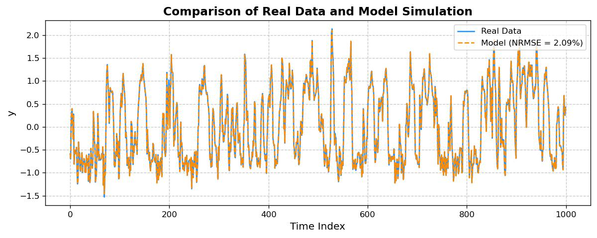

## deepSI\_lite

deepSI\_lite provides a lightweight pytorch based framework for data-driven learning of dynamical systems (i.e. system identification). It contains a large forcus on the SUBNET method which is able to robustly model many systems.

## Example usage

```python
# Generate data or load
np.random.seed(0)
ulist = np.random.randn(10_000) #input sequence
x = [0, 0] #initial state
ylist = [] #output sequence
for uk in ulist:
    ylist.append(x[1]*x[0]*0.1 + x[0] + np.random.randn()*1e-3)  #compute output
    x = x[0]/(1.2+x[1]**2) + x[1]*0.4, \
        x[1]/(1.2+x[0]**2) + x[0]*0.4 + uk*(1+x[0]**2/10) #advance state

# Put the inputs and outputs in a Input_output_data format
data = dsi.Input_output_data(u=ulist, y=np.array(ylist)) 

# Split dataset
train, val, test  = data[:8000], data[8000:9000], data[9000:]

# Create model
nu, ny, norm = dsi.get_nu_ny_and_auto_norm(data) #characterize data (i.e. number inputs, number outputs, range of input and output (norm))
model = dsi.SUBNET(nu, ny, norm, nx=2, nb=20, na=20) #creates the encoder, f and h as fully connected neural networks.

# Train model on data
train_dict = dsi.fit(model, train, val, n_its=10_000, T=20, batch_size=256, val_freq=100) #Adam optimization

# Simulate model on the test input sequence
test_p = model.simulate(test)

# Visualize resulting model
from matplotlib import pyplot as plt
plt.figure(figsize=(7,3))
plt.plot(test.y, label='real')
plt.plot(test_p.y, label=f'model NRMS = ({((test.y-test_p.y)**2).mean()**0.5/test.y.std():.2%})')
plt.legend(); plt.xlabel('time index'); plt.ylabel('y'); plt.grid(); plt.tight_layout(pad=0.5)
plt.show()
```



## Features

* A number of popular SUBNET model structures
  * SUBNET encoder structue (`deepSI_lite.models.SUBNET`)
    * see: https://arxiv.org/abs/2012.07697 or https://www.sciencedirect.com/science/article/pii/S0005109823003710
  * Continuous time SUBNET encoder structure (`deepSI_lite.models.SUBNET_CT`)
    * see: https://arxiv.org/abs/2204.09405 
  * Base class for fully custom SUBNET structures with shared parameters between `f`, `h` or `encoder`. (`deepSI_lite.models.Custom_SUBNET`)
  * CNN SUBNET (`CNN_SUBNET`)
    * see chapter 4: https://research.tue.nl/files/318935789/20240321_Beintema_hf.pdf
  * LPV SUBNET (`SUBNET_LPV` and `SUBNET_LPV_ext_scheduled`)
    * see: https://arxiv.org/abs/2204.04060
  * HNN SUBNET (`pHNN_SUBNET`)
    * see: https://arxiv.org/abs/2305.01338
* Connection to [`nonlinear_benchmarks`](https://github.com/GerbenBeintema/nonlinear_benchmarks) such that benchmarks can easily be loaded and evaluated on.
* Low amount of code such that it can be easily forked and edited to add missing features.

## Installation

```
conda install -c anaconda git
pip install git+https://github.com/GerbenBeintema/deepSI_lite@main
```

## Futher documentation

Check out [`examples/Demonstration deepSI_lite.ipynb`](examples/Demonstration deepSI_lite.ipynb).

## todo list and known issues

* Expand demonstration notebook with pHNN examples
* pHNN validation, 
* Issue where discrete time is printed in Input_output_data with torch.Tensors, and np.arrays sample time.
* General documentation 
* known issues: CT SUBNET and DT SUBNET does not produce the correct initial when the sampling time is altered. (the encoder assumes that the sampling time does not change)
* Change name from `deepSI_lite` -> `deepSI` 
* pypi data upload such that it can be easily installed with `pip install deepSI_lite`
* Improve speed with copy if enough memory is available. Also pre-transfer to GPU and maybe asyncroness getting of arrays.
* Known issues: The compile option in `fit` currently has a memory leak??
